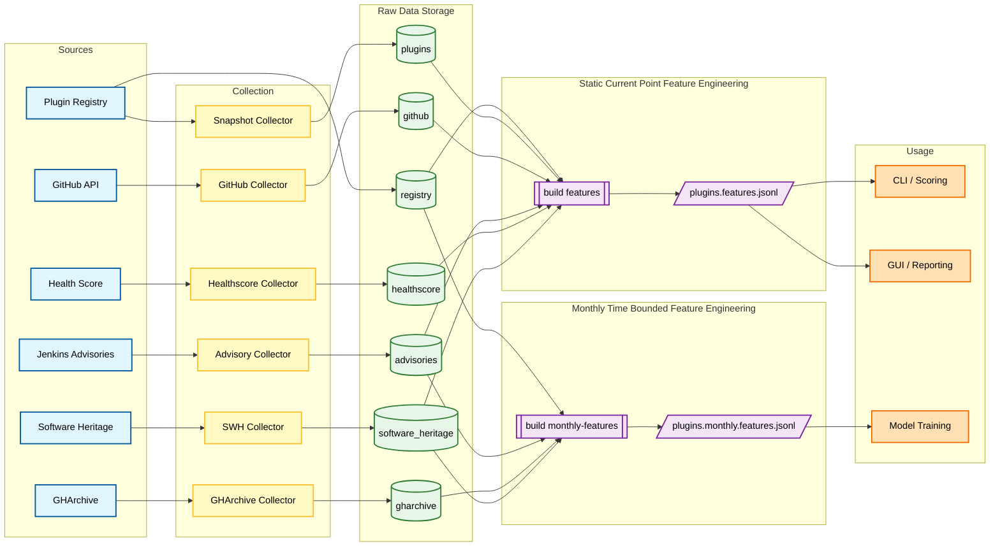

[](https://github.com/timmybx/canary/actions/workflows/ci.yml)
[](https://scorecard.dev/viewer/?uri=github.com/timmybx/canary)


[](https://microsoft.github.io/pyright/)
[](https://github.com/PyCQA/bandit)
[](https://github.com/timmybx/canary/actions/workflows/cflite_pr.yml)
[](https://github.com/timmybx/canary/actions/workflows/zizmor.yml)
[](https://github.com/timmybx/canary/actions/workflows/codeql.yml)

# 🐤 CANARY — Component Anomaly & Near-term Advisory Risk Yardstick

CANARY is a research prototype for collecting software ecosystem signals for Jenkins plugins and turning them into transparent, explainable risk indicators.

Today, CANARY has a working Docker-based CLI, a local web console, first-class collectors for registry/snapshot/advisory/healthscore/GitHub/GHArchive/Software Heritage data, and a baseline scorer. The project now produces two feature outputs: a broader static current-point feature bundle for scoring/reporting and a separate monthly time-bounded feature bundle for modeling.

> **Dependency source of truth:** `pyproject.toml` is the source of dependency declarations.  
> `requirements*.txt` files are generated lockfiles used for reproducible installs.

---

## 🔥 What CANARY Does Right Now

- ✅ Collects the Jenkins plugin registry (“universe snapshot”) as JSONL
- ✅ Collects per-plugin snapshot data
  - curated/offline mode for deterministic testing
  - real mode via the Jenkins plugins API
  - bulk mode over the registry
- ✅ Collects Jenkins advisories as JSONL
  - sample mode (offline / deterministic)
  - real mode via plugin snapshot → `securityWarnings` → advisory URLs
  - batch mode via `collect enrich`
- ✅ Collects the Jenkins Plugin Health Score dataset in bulk
- ✅ Batch-enriches plugins from the registry with snapshot + advisories + GitHub + healthscore + Software Heritage
- ✅ Collects historical GitHub activity windows from GH Archive via BigQuery
- ✅ Collects Software Heritage archival origin/visit/snapshot metadata
- ✅ Builds a static current-point feature bundle for scoring and reporting
- ✅ Builds a separate monthly time-bounded feature bundle for modeling
- ✅ Builds normalized advisory events for downstream analytics / ML
- ✅ Scores a plugin using explainable signals from multiple data sources
- ✅ Runs tests, linting, fuzzing, and security checks in a consistent Docker environment

---

## 📌 Current Status

Recent milestones:

- Integrated GH Archive collection into the main `canary collect gharchive` workflow
- Integrated Software Heritage collection into `collect enrich` and the feature pipeline
- Split generated features into two clean paths:
  - `plugins.features.*` for current-point scoring and reporting
  - `plugins.monthly.features.*` for time-bounded modeling
- Restricted the monthly dataset to time-bounded feature families only
- Validated historical collection at full-registry scale
- Successfully collected Software Heritage data for the large majority of registry plugins

That means CANARY now has a cleaner separation between present-day scoring/reporting and historical modeling, with the monthly dataset intentionally limited to time-bounded inputs.

---

## 🧭 CANARY Component Flow



---

## 📦 Project Structure

```text
├── canary/                         # Python package
│   ├── cli.py                      # CLI entrypoint (`canary ...`)
│   ├── webapp.py                   # Local web console (`python -m canary.webapp`)
│   ├── collectors/                 # Data collectors
│   │   ├── github_plugin.py
│   │   ├── gharchive_history.py
│   │   ├── healthscore.py
│   │   ├── jenkins_advisories.py
│   │   ├── plugin_snapshot.py
│   │   ├── plugins_registry.py
│   │   └── software_heritage.py
│   ├── build/                      # Dataset builders / normalizers
│   │   ├── advisories_events.py
│   │   ├── features_bundle.py
│   │   └── monthly_features.py
│   ├── datasets/                   # Auxiliary / legacy dataset scripts
│   │   └── github_repo_features.py
│   └── scoring/
│       └── baseline.py             # Baseline scorer (explainable)
├── fuzzers/
│   └── jenkins_url_fuzzer.py
├── tests/
├── data/
│   ├── raw/                        # Collected raw artifacts (generated)
│   │   ├── registry/
│   │   ├── plugins/
│   │   ├── advisories/
│   │   ├── github/
│   │   ├── healthscore/
│   │   ├── gharchive/
│   │   └── software_heritage/
│   └── processed/                  # Derived datasets / features (generated)
│       ├── events/
│       └── features/
├── .github/
│   ├── workflows/
│   └── rulesets/
├── Dockerfile
├── compose.yaml
├── Makefile
├── pyproject.toml
└── requirements*.txt               # Hash-locked lockfiles
```

### Data outputs (generated)

Raw:
- `data/raw/registry/plugins.jsonl` — plugin registry (the universe snapshot)
- `data/raw/plugins/<plugin>.snapshot.json` — plugin snapshot
- `data/raw/advisories/<plugin>.advisories.{sample|real}.jsonl` — advisories (per plugin)
- `data/raw/healthscore/plugins/plugins.healthscore.json` — bulk healthscore dataset
- `data/raw/github/<plugin>.*` — best-effort GitHub API payloads
- `data/raw/gharchive/windows/<start>_<end>.gharchive.jsonl` — historical GH Archive features by window
- `data/raw/gharchive/plugins/<plugin>.gharchive.jsonl` — historical GH Archive timeline per plugin
- `data/raw/gharchive/gharchive_index.json` — GH Archive collection run summary
- `data/raw/software_heritage/<plugin>.*` — Software Heritage origin / visits / latest visit / snapshot metadata

Processed:
- `data/processed/events/advisories.jsonl` — normalized/deduped advisory events stream
- `data/processed/features/plugins.features.jsonl` — static current-point feature bundle
- `data/processed/features/plugins.features.csv` — CSV export of the static feature bundle
- `data/processed/features/plugins.features.summary.json` — static feature summary
- `data/processed/features/plugins.monthly.features.jsonl` — monthly time-bounded feature bundle
- `data/processed/features/plugins.monthly.features.csv` — CSV export of the monthly feature bundle
- `data/processed/features/plugins.monthly.features.summary.json` — monthly feature summary

### Feature outputs

- `build features` creates the broader **static current-point** dataset used for current scoring, reporting, and GUI workflows. This path can use present-day enriched metadata.
- `build monthly-features` creates the **monthly time-bounded** dataset used for model training and evaluation. This path is intentionally restricted to time-bounded feature families.

---

## ✅ Prerequisites

The recommended local workflow is Docker Compose.

Required:
- Docker Desktop (includes Docker Engine and Docker Compose v2)
- Internet access for image pulls / dependency installation

Verify install:

```bash
docker --version
docker compose version
```

---

## 🚀 Quickstart

### 1) Build the image

```bash
docker compose build
```

### 2) Show CLI help

```bash
docker compose run --rm canary canary --help
```

### 3) Start the local web console

```bash
docker compose up canary-web
```

Then open:
- `http://localhost:8000`

The web console is currently aimed at local demos and day-to-day use. It can:
- score a plugin and show the JSON / reasons in the browser
- run collection / enrichment commands without memorizing flags
- show command preview and captured console output
- display the bundled CANARY logo and favicon

You can also run it directly inside the container with:

```bash
docker compose run --rm --service-ports canary-web
```

### 4) Collect the plugin registry

```bash
docker compose run --rm canary canary collect registry --real
```

Writes:
- `data/raw/registry/plugins.jsonl`

Sanity check for duplicate plugin IDs:

```bash
docker compose run --rm canary python - <<'PY'
import json
pids=[]
for line in open("data/raw/registry/plugins.jsonl", "r", encoding="utf-8"):
    if line.strip():
        pids.append(json.loads(line)["plugin_id"])
print("lines:", len(pids))
print("unique:", len(set(pids)))
PY
```

### 5) Batch-enrich plugins (recommended path)

Run all main collection stages for a smaller batch:

```bash
docker compose run --rm canary canary collect enrich --real --max-plugins 25
```

Run a larger batch:

```bash
docker compose run --rm canary canary collect enrich --real --max-plugins 200
```

Stage-specific examples:

```bash
docker compose run --rm canary canary collect enrich --real --only snapshot   --max-plugins 200
docker compose run --rm canary canary collect enrich --real --only advisories --max-plugins 200
docker compose run --rm canary canary collect enrich --real --only github     --max-plugins 200
docker compose run --rm canary canary collect enrich --real --only healthscore
docker compose run --rm canary canary collect enrich --real --only software-heritage --max-plugins 200
```

### 6) Collect a single plugin snapshot

Curated snapshot (offline):

```bash
docker compose run --rm canary canary collect plugin --id cucumber-reports
```

Real snapshot:

```bash
docker compose run --rm canary canary collect plugin --id cucumber-reports --real
```

### 7) Collect advisories for a single plugin

Sample mode:

```bash
docker compose run --rm canary canary collect advisories --plugin cucumber-reports --out-dir data/raw/advisories
```

Real mode:

```bash
docker compose run --rm canary canary collect advisories --plugin cucumber-reports --real --data-dir data/raw --out-dir data/raw/advisories
```

### 8) Collect healthscores (bulk)

```bash
docker compose run --rm canary canary collect healthscore
```

Writes:
- `data/raw/healthscore/plugins/plugins.healthscore.json`

### 9) Build normalized advisory events

```bash
docker compose run --rm canary canary build advisories-events
```

Writes:
- `data/processed/events/advisories.jsonl`

### 10) Build static features

```bash
docker compose run --rm canary canary build features
```

Writes:
- `data/processed/features/plugins.features.jsonl`
- `data/processed/features/plugins.features.csv`
- `data/processed/features/plugins.features.summary.json`

### 11) Build monthly time-bounded features

```bash
docker compose run --rm canary canary build monthly-features --start 2024-01 --end 2025-12
```

Writes:
- `data/processed/features/plugins.monthly.features.jsonl`
- `data/processed/features/plugins.monthly.features.csv`
- `data/processed/features/plugins.monthly.features.summary.json`

### 12) Score a plugin

```bash
docker compose run --rm canary canary score cucumber-reports --real --json
```

Output includes:
- final numeric score
- human-readable reasons
- raw feature values

---

## 📚 Historical GitHub Activity via GH Archive (BigQuery)

CANARY includes a first-class collector for historical GitHub activity windows pulled from GH Archive via BigQuery. The collector writes CANARY-style JSON artifacts under `data/raw/gharchive/` so the historical data lines up with the rest of the project.

### 1) One-time local setup (Google Cloud CLI + ADC)

Install Google Cloud CLI, then initialize and authenticate:

```bash
gcloud --version
gcloud init
gcloud config set project <YOUR_PROJECT_ID>
gcloud services enable bigquery.googleapis.com --project <YOUR_PROJECT_ID>
gcloud auth application-default login
gcloud auth application-default set-quota-project <YOUR_PROJECT_ID>
```

Install the Python dependency in the environment that will run the collector:

```bash
pip install google-cloud-bigquery
```

### 2) Make sure plugin snapshots exist

The GH Archive collector uses plugin snapshots to resolve plugins to GitHub repositories.

```bash
docker compose run --rm canary canary collect enrich --real --only snapshot --max-plugins 200
```

Or for one plugin:

```bash
docker compose run --rm canary canary collect plugin --id cucumber-reports --real
```

### 3) Collect historical windows

Example: full registry, full year, 30-day windows, 1% sample:

```bash
docker compose run --rm canary canary collect gharchive \
  --registry-path ./data/raw/registry/plugins.jsonl \
  --start 20250101 \
  --end 20251231 \
  --bucket-days 30 \
  --sample-percent 1.0 \
  --max-bytes-billed 600000000000 \
  --overwrite
```

Single-plugin example:

```bash
docker compose run --rm canary canary collect gharchive \
  --plugin cucumber-reports \
  --start 20250101 \
  --end 20250331 \
  --bucket-days 30
```

Writes:
- `data/raw/gharchive/windows/<start>_<end>.gharchive.jsonl`
- `data/raw/gharchive/plugins/<plugin>.gharchive.jsonl`
- `data/raw/gharchive/gharchive_index.json`

Each record includes a plugin id, repo name, time window, and historical activity features such as:
- pushes / committers / active days
- PR open / close / merge counts
- issue open / close / reopen counts
- merge / close latency proxies
- churn / owner concentration / security-label proxy

### 4) Practical notes on cost and sampling

- Queries are executed window-by-window, which keeps collection manageable and easier to reason about.
- `--max-bytes-billed` is your main safety rail for BigQuery cost control.
- `--sample-percent 1.0` means **1% TABLESAMPLE**, not 100%.
- In practice, scan volume has scaled primarily with **time range**, while adding more plugins mainly increased matches returned.

### 5) Fallback behavior

If a snapshot lacks an explicit GitHub repo mapping, you can optionally fall back to the common `jenkinsci/<plugin>-plugin` naming convention:

```bash
docker compose run --rm canary canary collect gharchive \
  --start 20250101 \
  --end 20250331 \
  --allow-jenkinsci-fallback
```

---

## 🗂️ GitHub Repo Feature Script (auxiliary / legacy path)

Use this for standalone repo metadata experiments outside the main CANARY collection + feature-build pipeline.

Optional: set a GitHub token first:

```bash
export GITHUB_TOKEN=<your_token>
```

PowerShell:

```powershell
$env:GITHUB_TOKEN="<your_token>"
```

Examples:

```bash
make github-features
```

```bash
python -m canary.datasets.github_repo_features --org jenkinsci --repo-suffix -plugin --max-repos 25 --out data/processed/github_repo_features.csv
```

Skip Scorecard API enrichment:

```bash
python -m canary.datasets.github_repo_features --skip-scorecard
```

Include Dependabot / code-scanning alert metrics:

```bash
python -m canary.datasets.github_repo_features --include-alerts
```

---

## 🧪 Running Tests

```bash
docker compose run --rm canary pytest
```

Generate HTML coverage:

```bash
docker compose run --rm canary pytest --cov-report=html
```

Then open `htmlcov/index.html`.

---

## 🧹 Linting & Formatting

Fix lint issues Ruff can auto-fix:

```bash
docker compose run --rm canary ruff check . --fix
```

Format code:

```bash
docker compose run --rm canary ruff format .
```

---

## 🔐 Security & Supply Chain Notes

CANARY aims to be reproducible and supply-chain aware:

- dependencies are hash-locked (`requirements*.txt`) and installed with `--require-hashes` in containers / CI
- vulnerability auditing runs in Docker to reduce OS-specific drift
- GitHub Actions are pinned to commit SHAs where practical
- OpenSSF Scorecard is enabled to track supply-chain posture over time

---

## 🧠 How Baseline Scoring Works

CANARY’s current scorer is intentionally simple and explainable. It combines:

- **name heuristics** (keywords that suggest auth/security or SCM surface area)
- **advisory features**
  - advisory count
  - most recent advisory date
  - recency-weighted advisory risk
- **plugin snapshot features**
  - required Jenkins core
  - dependency count (surface area proxy)
  - security warnings
  - release recency
- **healthscore features**
  - healthscore value/date
  - small risk-points mapping (higher health = lower risk)

Output includes the final score, human-readable reasons, and raw feature values in JSON mode.

---

## 🧩 Near-Term Integration Work

The next technical layer for CANARY is less about adding isolated collectors and more about connecting them cleanly.

Good next steps include:

- per-plugin feature bundles such as `data/processed/features/<plugin>.features.json`
- a unifying dataset builder that joins:
  - registry
  - plugin snapshot
  - advisories / advisory events
  - healthscore
  - GitHub API signals
  - GH Archive historical windows
- time-sliced “as-of date” datasets for ML experiments
- lightweight schema/version metadata for generated datasets
- GUI updates that expose more collection options without requiring CLI-only workflows
  - date pickers / calendar widgets for historical collection
  - preset ranges such as 30 days / 90 days / 1 year
  - sample / byte-cap fields surfaced in the web UI
  - collection progress and output summaries

---

## 🗺️ Roadmap

- [x] CLI scaffold (`collect`, `score`) with Docker Compose workflow
- [x] Plugin snapshot collection (curated + `--real` via Jenkins plugins API)
- [x] Plugin registry collection (`collect registry`)
- [x] Advisory collection (sample + real)
- [x] Healthscore bulk collector
- [x] Historical GH Archive collector integrated into the main workflow
- [x] Baseline scoring with explainable features
- [x] Add GitHub signals as first-class collectors in `collect enrich`
- [ ] Build per-plugin feature bundles (`data/processed/features/<plugin>.features.json`)
- [ ] Build a unified training / analysis dataset from collected sources
- [ ] Add time-sliced dataset builders for ML (`as_of_date`, prediction horizon)
- [ ] Expand the web UI with collection forms, date widgets, and richer output summaries

---

## 🧯 Troubleshooting

### Registry has duplicates (`unique << lines`)

If you see far fewer unique `plugin_id`s than lines in `plugins.jsonl`, downstream bulk collection will only cover that smaller set. Re-run `collect registry --real` and verify uniqueness with the snippet above.

### `FileNotFoundError` for `--registry-path`

If the file exists in the repo but the command cannot find it, double-check the relative path you passed inside the containerized working directory. For example, this commonly works:

```bash
--registry-path ./data/raw/registry/plugins.jsonl
```

### Rebuild if Docker cached something weird

```bash
docker compose build --no-cache canary
```

---

## 📖 How to Cite

If you use CANARY in academic work, please cite it using the metadata in [`CITATION.cff`](CITATION.cff).
GitHub displays a **Cite this repository** button on the repository home page that generates APA and BibTeX entries automatically.

---

## 📄 License

Apache-2.0

---

## ⚠️ Disclaimer

This is a research prototype. Scores are **not** security guarantees and should not be used as the sole basis for operational risk decisions.

---

## 👤 Author

**Timothy Brennan**
