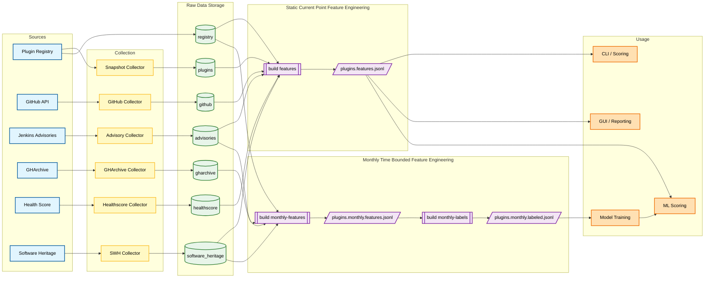

[](https://github.com/timmybx/canary/actions/workflows/ci.yml)
[](https://scorecard.dev/viewer/?uri=github.com/timmybx/canary)


[](https://microsoft.github.io/pyright/)
[](https://github.com/PyCQA/bandit)
[](https://github.com/timmybx/canary/actions/workflows/cflite_pr.yml)
[](https://github.com/timmybx/canary/actions/workflows/zizmor.yml)
[](https://github.com/timmybx/canary/actions/workflows/codeql.yml)

# 🐤 CANARY — Component Analytics & Near-term Advisory Risk Yardstick

CANARY is a research prototype that predicts near-term security advisory risk for Jenkins plugins using publicly observable project signals — commit patterns, governance artifacts, advisory history, and ecosystem metadata.

A live demo is available at **[canary-score.com](https://canary-score.com)**, where you can score any Jenkins plugin, explore pre-trained ML model results across 64 model configurations, and view validated predictions alongside confirmed security advisories.

The project includes a Docker-based CLI, a publicly deployed web console, collectors for registry/snapshot/advisory/healthscore/GitHub/GHArchive/Software Heritage data, an ML scoring pipeline trained on six years of historical data, feature selection analysis, operational precision@k evaluation, and an AI-powered explanation feature.

> **Dependency source of truth:** `pyproject.toml` is the source of dependency declarations.  
> `requirements*.txt` files are generated lockfiles used for reproducible installs.

---

## 🔥 What CANARY Does Right Now

- ✅ Collects the Jenkins plugin registry (“universe snapshot”) as JSONL
- ✅ Collects per-plugin snapshot data
  - curated/offline mode for deterministic testing
  - real mode via the Jenkins plugins API
  - bulk mode over the registry
- ✅ Collects Jenkins advisories as JSONL
  - sample mode (offline / deterministic)
  - real mode via plugin snapshot → `securityWarnings` → advisory URLs
  - batch mode via `collect enrich`
- ✅ Collects the Jenkins Plugin Health Score dataset in bulk
- ✅ Batch-enriches plugins from the registry with snapshot + advisories + GitHub + healthscore + Software Heritage
- ✅ Collects historical GitHub activity windows from GH Archive via BigQuery
- ✅ Collects Software Heritage archival origin/visit/snapshot metadata
- ✅ Builds a static current-point feature bundle for scoring and reporting
- ✅ Builds a separate monthly time-bounded feature bundle for modeling
- ✅ Labels monthly feature rows with future advisory horizons
- ✅ Builds normalized advisory events for downstream analytics / ML
- ✅ Trains baseline ML models on labeled monthly rows
- ✅ Scores a plugin with an ML-backed advisory risk probability and interpretable SHAP-based feature drivers
- ✅ Provides AI-powered plain-English explanations of scores via Claude or ChatGPT
- ✅ Validates predictions against confirmed Jenkins security advisories in the case study tab
- ✅ Runs tests, linting, fuzzing, and security checks in a consistent Docker environment

---

## 📌 Current Status

Recent milestones:

- Integrated GH Archive collection into the main `canary collect gharchive` workflow
- Integrated Software Heritage collection into `collect enrich` and the feature pipeline
- Split generated features into two clean paths:
  - `plugins.features.*` for current-point scoring and reporting
  - `plugins.monthly.features.*` for time-bounded modeling
- Restricted the monthly dataset to time-bounded feature families only
- Added future advisory labeling with configurable horizons
- Added baseline model training outputs and an ML scoring CLI / web-console path
- Validated historical collection at full-registry scale
- Successfully collected Software Heritage data for the large majority of registry plugins

That means CANARY now has a cleaner separation between present-day scoring/reporting and historical modeling, with the monthly dataset intentionally limited to time-bounded inputs and the labeled dataset feeding repeatable baseline model runs.

---

## 🧭 CANARY Component Flow



---

## 📦 Project Structure

```text
├── canary/                         # Python package
│   ├── cli.py                      # CLI entrypoint (`canary ...`)
│   ├── webapp.py                   # Local web console (`python -m canary.webapp`)
│   ├── collectors/                 # Data collectors
│   │   ├── github_plugin.py
│   │   ├── gharchive_history.py
│   │   ├── healthscore.py
│   │   ├── jenkins_advisories.py
│   │   ├── plugin_snapshot.py
│   │   ├── plugins_registry.py
│   │   └── software_heritage.py
│   ├── build/                      # Dataset builders / normalizers
│   │   ├── advisories_events.py
│   │   ├── features_bundle.py
│   │   ├── monthly_labels.py
│   │   └── monthly_features.py
│   ├── datasets/                   # Auxiliary / legacy dataset scripts
│   │   └── github_repo_features.py
│   ├── train/
│   │   ├── baseline.py              # Baseline model training
│   │   └── registry.py              # Model registry
│   └── scoring/
│       ├── baseline.py              # Heuristic scorer (explainable)
│       └── ml.py                    # ML-backed scorer
├── fuzzers/
│   └── jenkins_url_fuzzer.py
├── tests/
├── data/
│   ├── raw/                        # Collected raw artifacts (generated)
│   │   ├── registry/
│   │   ├── plugins/
│   │   ├── advisories/
│   │   ├── github/
│   │   ├── healthscore/
│   │   ├── gharchive/
│   │   └── software_heritage/
│   └── processed/                  # Derived datasets / features (generated)
│       ├── events/
│       ├── features/
│       └── models/
├── .github/
│   ├── workflows/
│   └── rulesets/
├── Dockerfile
├── compose.yaml
├── Makefile
├── pyproject.toml
└── requirements*.txt               # Hash-locked lockfiles
```

### Data outputs (generated)

Raw:
- `data/raw/registry/plugins.jsonl` — plugin registry (the universe snapshot)
- `data/raw/plugins/<plugin>.snapshot.json` — plugin snapshot
- `data/raw/advisories/<plugin>.advisories.{sample|real}.jsonl` — advisories (per plugin)
- `data/raw/healthscore/plugins/plugins.healthscore.json` — bulk healthscore dataset
- `data/raw/github/<plugin>.*` — best-effort GitHub API payloads
- `data/raw/gharchive/windows/<start>_<end>.gharchive.jsonl` — historical GH Archive features by window
- `data/raw/gharchive/plugins/<plugin>.gharchive.jsonl` — historical GH Archive timeline per plugin
- `data/raw/gharchive/gharchive_index.json` — GH Archive collection run summary
- `data/raw/software_heritage_api/<plugin>.swh_{index|origin|visits|latest_visit|snapshot}.json` and `data/raw/software_heritage_athena/<plugin>.swh_athena_index.json` + `data/raw/software_heritage_athena/<plugin>.swh_athena_visits.jsonl` — Software Heritage metadata from API and Athena backends

Processed:
- `data/processed/events/advisories.jsonl` — normalized/deduped advisory events stream
- `data/processed/features/plugins.features.jsonl` — static current-point feature bundle
- `data/processed/features/plugins.features.csv` — CSV export of the static feature bundle
- `data/processed/features/plugins.features.summary.json` — static feature summary
- `data/processed/features/plugins.monthly.features.jsonl` — monthly time-bounded feature bundle
- `data/processed/features/plugins.monthly.features.csv` — CSV export of the monthly feature bundle
- `data/processed/features/plugins.monthly.features.summary.json` — monthly feature summary
- `data/processed/features/plugins.monthly.labeled.jsonl` — monthly features with future advisory labels
- `data/processed/features/plugins.monthly.labeled.csv` — CSV export of labeled monthly rows
- `data/processed/features/plugins.monthly.labeled.summary.json` — labeled monthly summary
- `data/processed/models/<run>/metrics.json` — model metrics and selected feature columns
- `data/processed/models/<run>/model.joblib` — trained sklearn pipeline
- `data/processed/models/<run>/feature_columns.json` — ordered feature contract used by ML scoring
- `data/processed/models/<run>/test_predictions.csv` — held-out predictions ranked by predicted probability
- `data/processed/models/<run>/precision_at_k.json` — operational precision@k analysis and scenario results
- `data/processed/models/<run>/feature_selection.json` — SHAP-based feature selection results (H3 analysis)

### Feature outputs

- `build features` creates the broader **static current-point** dataset used for current scoring, reporting, and GUI workflows. This path can use present-day enriched metadata.
- `build monthly-features` creates the **monthly time-bounded** dataset used for model training and evaluation. This path is intentionally restricted to time-bounded feature families.
- `build monthly-labels` adds future advisory labels such as `label_advisory_within_6m` to the monthly rows.
- `train baseline` fits a baseline model from labeled monthly rows and writes reusable model artifacts for `score-ml` and the web console.

---

## ✅ Prerequisites

CANARY can run from a plain Python 3.12 virtual environment. Docker Compose remains supported for reproducible CI-like runs and local demos.

Required:
- Python 3.12+
- Internet access for dependency installation

Optional:
- Docker Desktop (includes Docker Engine and Docker Compose v2)

Local Python setup:

```bash
python -m pip install --require-hashes -r requirements.txt
python -m pip install --require-hashes -r requirements-dev.txt
```

Verify Docker install if you plan to use Compose:

```bash
docker --version
docker compose version
```

---

## 🚀 Quickstart

The examples below use Docker Compose. In a local Python environment, drop the `docker compose run --rm canary` prefix and run the `canary ...` command directly.

### 1) Build the image

```bash
docker compose build
```

### 2) Show CLI help

```bash
docker compose run --rm canary canary --help
```

### 3) Start the local web console

```bash
docker compose up canary-web
```

Then open:
- `http://localhost:8000`

With a local Python environment, you can also run:

```bash
canary-web
```

The web console is publicly deployed at **[canary-score.com](https://canary-score.com)** and can also be run locally. It provides:
- **Scoring tab** — score any Jenkins plugin with an ML advisory risk probability, SHAP-based feature drivers, supporting signals, and an AI-powered plain-English explanation
- **Machine learning tab** — explore 64 pre-trained model configurations across four algorithms, eight feature sets, and two evaluation strategies — the complete 4×8×2 experiment matrix; includes operational precision@k analysis and feature selection (H3) results
- **Case study tab** — see top-ranked predictions validated against confirmed Jenkins security advisories with CVE details, severity, and lead time
- **About tab** — quick-start guide and background on the CANARY methodology

You can also run it directly inside the container with:

```bash
docker compose run --rm --service-ports canary-web
```

### 4) Collect the plugin registry

```bash
docker compose run --rm canary canary collect registry --real
```

Writes:
- `data/raw/registry/plugins.jsonl`

Sanity check for duplicate plugin IDs:

```bash
docker compose run --rm canary python - <<'PY'
import json
pids=[]
for line in open("data/raw/registry/plugins.jsonl", "r", encoding="utf-8"):
    if line.strip():
        pids.append(json.loads(line)["plugin_id"])
print("lines:", len(pids))
print("unique:", len(set(pids)))
PY
```

### 5) Batch-enrich plugins (recommended path)

Run all main collection stages for a smaller batch:

```bash
docker compose run --rm canary canary collect enrich --real --max-plugins 25
```

Run a larger batch:

```bash
docker compose run --rm canary canary collect enrich --real --max-plugins 200
```

Stage-specific examples:

```bash
docker compose run --rm canary canary collect enrich --real --only snapshot   --max-plugins 200
docker compose run --rm canary canary collect enrich --real --only advisories --max-plugins 200
docker compose run --rm canary canary collect enrich --real --only github     --max-plugins 200
docker compose run --rm canary canary collect enrich --real --only healthscore
docker compose run --rm canary canary collect enrich --real --only software-heritage --max-plugins 200
```

### 6) Collect a single plugin snapshot

Curated snapshot (offline):

```bash
docker compose run --rm canary canary collect plugin --id cucumber-reports
```

Real snapshot:

```bash
docker compose run --rm canary canary collect plugin --id cucumber-reports --real
```

### 7) Collect advisories for a single plugin

Sample mode:

```bash
docker compose run --rm canary canary collect advisories --plugin cucumber-reports --out-dir data/raw/advisories
```

Real mode:

```bash
docker compose run --rm canary canary collect advisories --plugin cucumber-reports --real --data-dir data/raw --out-dir data/raw/advisories
```

### 8) Collect healthscores (bulk)

```bash
docker compose run --rm canary canary collect healthscore
```

Writes:
- `data/raw/healthscore/plugins/plugins.healthscore.json`

### 9) Build normalized advisory events

```bash
docker compose run --rm canary canary build advisories-events
```

Writes:
- `data/processed/events/advisories.jsonl`

### 10) Build static features

```bash
docker compose run --rm canary canary build features
```

Writes:
- `data/processed/features/plugins.features.jsonl`
- `data/processed/features/plugins.features.csv`
- `data/processed/features/plugins.features.summary.json`

### 11) Build monthly time-bounded features

```bash
docker compose run --rm canary canary build monthly-features --start 2024-01 --end 2025-12
```

Writes:
- `data/processed/features/plugins.monthly.features.jsonl`
- `data/processed/features/plugins.monthly.features.csv`
- `data/processed/features/plugins.monthly.features.summary.json`

### 12) Label monthly rows for ML

```bash
docker compose run --rm canary canary build monthly-labels
```

Writes:
- `data/processed/features/plugins.monthly.labeled.jsonl`
- `data/processed/features/plugins.monthly.labeled.csv`
- `data/processed/features/plugins.monthly.labeled.summary.json`

### 13) Train a baseline model

```bash
docker compose run --rm canary canary train baseline --model logistic
```

The default target is `label_advisory_within_6m`, and the default output directory is:
- `data/processed/models/baseline_6m`

Available model names are `logistic`, `random_forest`, `xgboost`, and `lightgbm`.
`xgboost` and `lightgbm` require their optional packages to be installed.

### 14) Score a plugin with the heuristic scorer

```bash
docker compose run --rm canary canary score cucumber-reports --real --json
```

Output includes:
- final numeric score
- human-readable reasons
- raw feature values

### 15) Score a plugin with a trained ML model

```bash
docker compose run --rm canary canary score-ml cucumber-reports --model-dir data/processed/models/baseline_6m --json
```

Output includes:
- predicted advisory risk probability
- risk category
- top contributing features
- feature vector aligned to the trained model contract

---

## 📚 Historical GitHub Activity via GH Archive (BigQuery)

CANARY includes a first-class collector for historical GitHub activity windows pulled from GH Archive via BigQuery. The collector writes CANARY-style JSON artifacts under `data/raw/gharchive/` so the historical data lines up with the rest of the project.

### 1) One-time local setup (Google Cloud CLI + ADC)

Install Google Cloud CLI, then initialize and authenticate:

```bash
gcloud --version
gcloud init
gcloud config set project <YOUR_PROJECT_ID>
gcloud services enable bigquery.googleapis.com --project <YOUR_PROJECT_ID>
gcloud auth application-default login
gcloud auth application-default set-quota-project <YOUR_PROJECT_ID>
```

Install the Python dependency in the environment that will run the collector:

```bash
pip install google-cloud-bigquery
```

### 2) Make sure plugin snapshots exist

The GH Archive collector uses plugin snapshots to resolve plugins to GitHub repositories.

```bash
docker compose run --rm canary canary collect enrich --real --only snapshot --max-plugins 200
```

Or for one plugin:

```bash
docker compose run --rm canary canary collect plugin --id cucumber-reports --real
```

### 3) Collect historical windows

Example: full registry, full year, 30-day windows, 1% sample:

```bash
docker compose run --rm canary canary collect gharchive \
  --registry-path ./data/raw/registry/plugins.jsonl \
  --start 20250101 \
  --end 20251231 \
  --bucket-days 30 \
  --sample-percent 1.0 \
  --max-bytes-billed 600000000000 \
  --overwrite
```

Single-plugin example:

```bash
docker compose run --rm canary canary collect gharchive \
  --plugin cucumber-reports \
  --start 20250101 \
  --end 20250331 \
  --bucket-days 30
```

Writes:
- `data/raw/gharchive/windows/<start>_<end>.gharchive.jsonl`
- `data/raw/gharchive/plugins/<plugin>.gharchive.jsonl`
- `data/raw/gharchive/gharchive_index.json`

Each record includes a plugin id, repo name, time window, and historical activity features such as:
- pushes / committers / active days
- PR open / close / merge counts
- issue open / close / reopen counts
- merge / close latency proxies
- churn / owner concentration / security-label proxy

### 4) Practical notes on cost and sampling

- Queries are executed window-by-window, which keeps collection manageable and easier to reason about.
- `--max-bytes-billed` is your main safety rail for BigQuery cost control.
- `--sample-percent 1.0` means **1% TABLESAMPLE**, not 100%.
- In practice, scan volume has scaled primarily with **time range**, while adding more plugins mainly increased matches returned.

### 5) Fallback behavior

If a snapshot lacks an explicit GitHub repo mapping, you can optionally fall back to the common `jenkinsci/<plugin>-plugin` naming convention:

```bash
docker compose run --rm canary canary collect gharchive \
  --start 20250101 \
  --end 20250331 \
  --allow-jenkinsci-fallback
```

---

## 🗂️ GitHub Repo Feature Script (auxiliary / legacy path)

Use this for standalone repo metadata experiments outside the main CANARY collection + feature-build pipeline.

Optional: set a GitHub token first:

```bash
export GITHUB_TOKEN=<your_token>
```

PowerShell:

```powershell
$env:GITHUB_TOKEN="<your_token>"
```

Examples:

```bash
make github-features
```

```bash
python -m canary.datasets.github_repo_features --org jenkinsci --repo-suffix -plugin --max-repos 25 --out data/processed/github_repo_features.csv
```

Skip Scorecard API enrichment:

```bash
python -m canary.datasets.github_repo_features --skip-scorecard
```

Include Dependabot / code-scanning alert metrics:

```bash
python -m canary.datasets.github_repo_features --include-alerts
```

---

## 🧪 Running Tests

```bash
pytest -ra
```

Docker equivalent:

```bash
docker compose run --rm canary pytest
```

Generate HTML coverage:

```bash
docker compose run --rm canary pytest --cov-report=html
```

Then open `htmlcov/index.html`.

---

## 🧹 Linting & Formatting

Fix lint issues Ruff can auto-fix:

```bash
ruff check . --fix
```

Docker equivalent:

```bash
docker compose run --rm canary ruff check . --fix
```

Format code:

```bash
ruff format .
```

Docker equivalent:

```bash
docker compose run --rm canary ruff format .
```

---

## 🔐 Security & Supply Chain Notes

CANARY aims to be reproducible and supply-chain aware:

- dependencies are hash-locked (`requirements*.txt`) and installed with `--require-hashes` in containers / CI
- vulnerability auditing runs in Docker to reduce OS-specific drift
- GitHub Actions are pinned to commit SHAs where practical
- OpenSSF Scorecard is enabled to track supply-chain posture over time

---

## 🧠 How Scoring Works

The primary CANARY score is an ML-backed advisory risk probability — the estimated likelihood that a plugin will appear in a Jenkins security advisory within the next 180 days. The score is produced by gradient-boosted tree models (XGBoost, LightGBM) trained on six years of monthly plugin observations.

**Key input signals:**

- **Software Heritage** — commit staleness, security-fix commit patterns, governance artifacts (`SECURITY.md`, changelogs, CI config), repository age, and revision-history signals
- **GH Archive** — historical release cadence, pull request activity, contributor diversity, and maintenance regularity
- **Advisory history** — prior advisory count, recency, and maximum observed CVSS severity
- **Plugin ecosystem** — dependency risk, Jenkins core version requirements, health score, and security warnings

**Model output:**

- Advisory risk probability (0.0–1.0) with Low / Medium / High risk category
- Top contributing features with SHAP-based direction and value
- Supporting signals including dependency risk and governance indicators
- AI-powered plain-English explanation (via Claude or ChatGPT)

The `canary score-ml` CLI path loads a trained model from `data/processed/models/<run>/`, builds a current feature vector from collected raw data, and returns an advisory-risk probability, category, top drivers, and the aligned feature vector.

---

## 🔬 Research Status

CANARY is being developed as a Doctor of Engineering praxis at The George Washington University. Key empirical results from the current research phase:

- **XGBoost (full features, time split):** ROC-AUC 0.960, Average Precision 0.764
- **Precision@K:** top-10 plugins = 100% precision (53× lift), top-50 = 92% precision (49× lift)
- **Feature selection (H3):** a 15-feature subset of the no-window model retains 93.9% of full-model AP
- **Case study validation:** 18 of 25 top-ranked predictions confirmed by Jenkins security advisories published within the 180-day window
- **Training data:** approximately 180,000 plugin-month observations from 2019–2025

---

## 🗺️ Roadmap

- [x] CLI scaffold (`collect`, `score`) with Docker Compose workflow
- [x] Plugin snapshot collection (curated + `--real` via Jenkins plugins API)
- [x] Plugin registry collection (`collect registry`)
- [x] Advisory collection (sample + real)
- [x] Healthscore bulk collector
- [x] Historical GH Archive collector integrated into the main workflow
- [x] Baseline scoring with explainable features
- [x] Add GitHub signals as first-class collectors in `collect enrich`
- [x] Build monthly advisory labels for ML training
- [x] Train baseline ML models from labeled monthly features
- [x] Add ML-backed plugin scoring with SHAP feature drivers
- [x] Feature selection study (H3 analysis) across model families
- [x] Operational precision@k analysis and scenario evaluation
- [x] Deploy publicly accessible web console (canary-score.com)
- [x] AI-powered plain-English score explanations (Claude / ChatGPT)
- [x] Case study tab — validated predictions vs. confirmed advisories
- [x] Complete 64-model experiment matrix across 4 algorithms × 8 feature sets × 2 evaluation strategies
- [ ] Generalization to OSS ecosystems beyond Jenkins
- [ ] Longitudinal drift analysis as new advisories are published
- [ ] Severity-aware scoring (weight predictions by expected CVSS)

---

## 🧯 Troubleshooting

### Registry has duplicates (`unique << lines`)

If you see far fewer unique `plugin_id`s than lines in `plugins.jsonl`, downstream bulk collection will only cover that smaller set. Re-run `collect registry --real` and verify uniqueness with the snippet above.

### `FileNotFoundError` for `--registry-path`

If the file exists in the repo but the command cannot find it, double-check the relative path you passed inside the containerized working directory. For example, this commonly works:

```bash
--registry-path ./data/raw/registry/plugins.jsonl
```

### Rebuild if Docker cached something weird

```bash
docker compose build --no-cache canary
```

---

## 📖 How to Cite

If you use CANARY in academic work, please cite it using the metadata in [`CITATION.cff`](CITATION.cff).
GitHub displays a **Cite this repository** button on the repository home page that generates APA and BibTeX entries automatically.

---

## 📄 License

Apache-2.0

---

## ⚠️ Disclaimer

This is a research prototype. Scores are **not** security guarantees and should not be used as the sole basis for operational risk decisions.

---

## 👤 Author

**Timothy Brennan**
